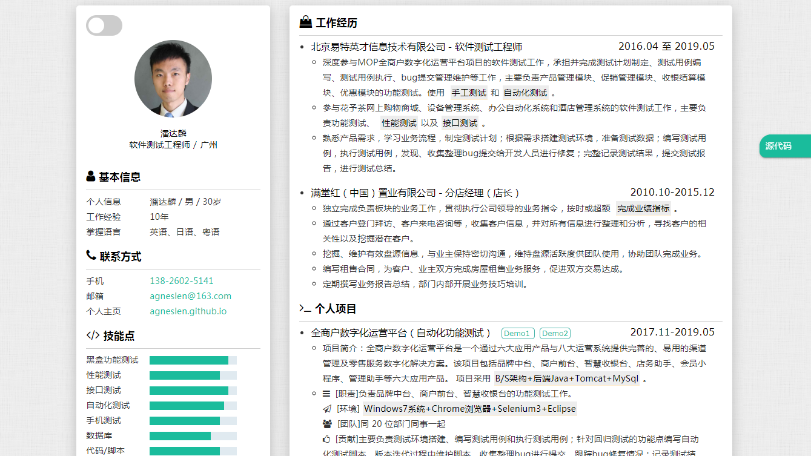

    

# 个人简历模板

[https://agneslen.github.io/](https://agneslen.github.io/)

## Intro

此我在网上找来的简历模板，修改后作为求职用。

## Object

程序员求职

## Usage

1. 先Star/Fork本项目，然后Clone或者直接下载到本地
2. 修改index.html内相关信息
3. 微调样式（作为前端求职，这点应该不成问题）
4. 生成pdf(开发中)
5. 部署到线上
6. 生成访问二维码（开发中）
7. 祝您求职成功！

## Preview

### PC端

### 移动端
